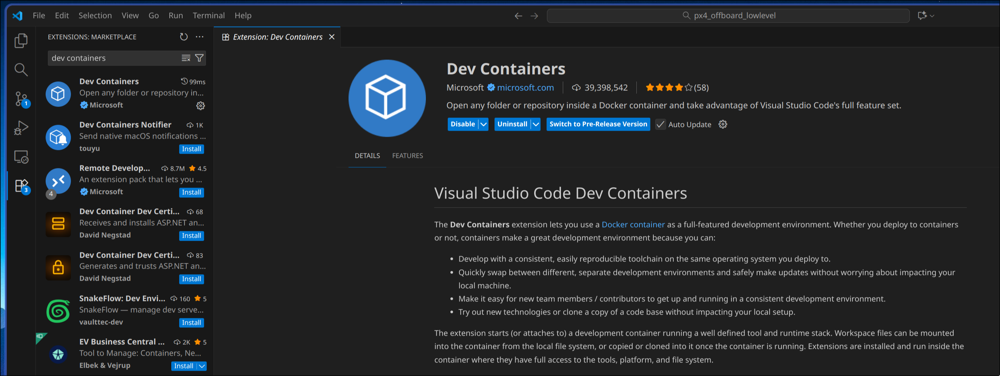
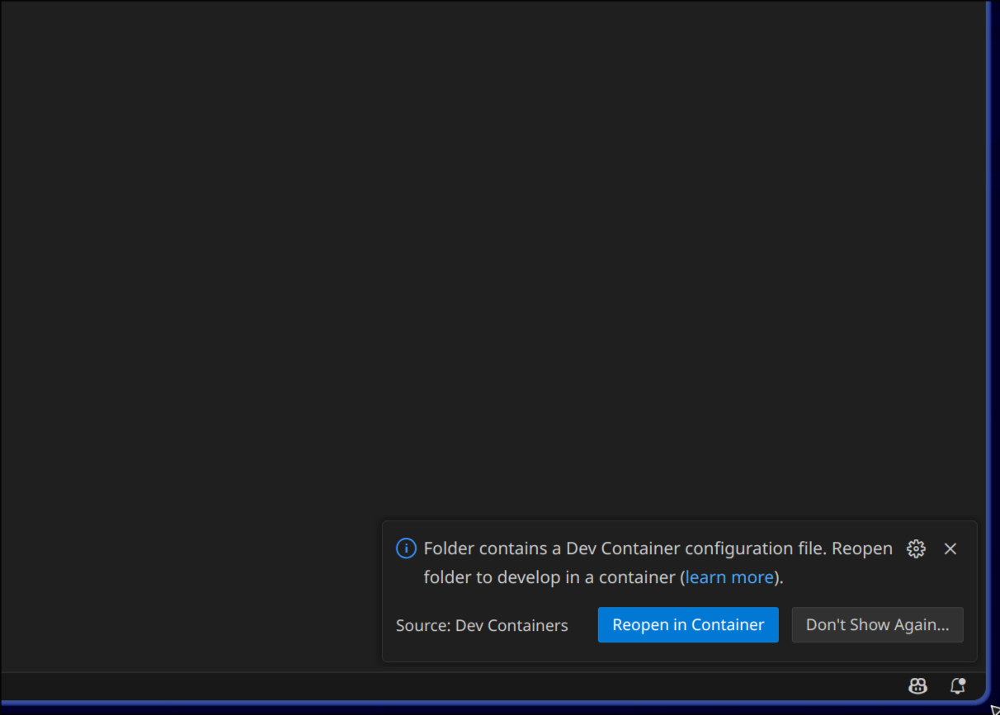
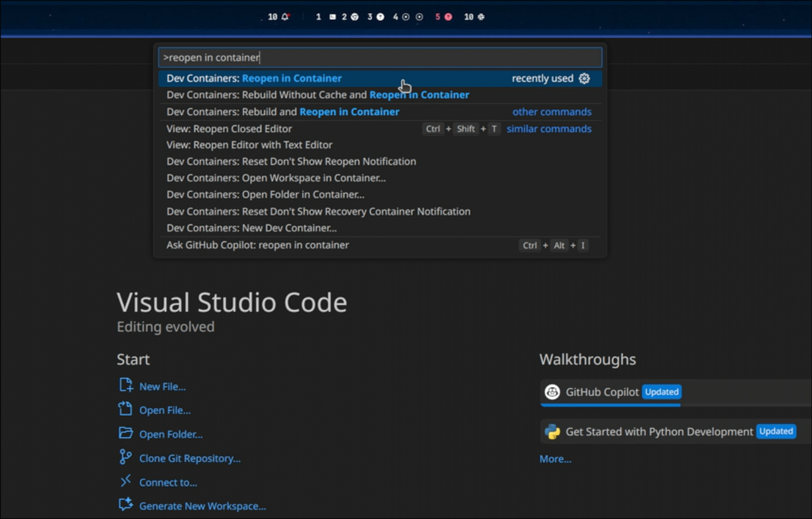
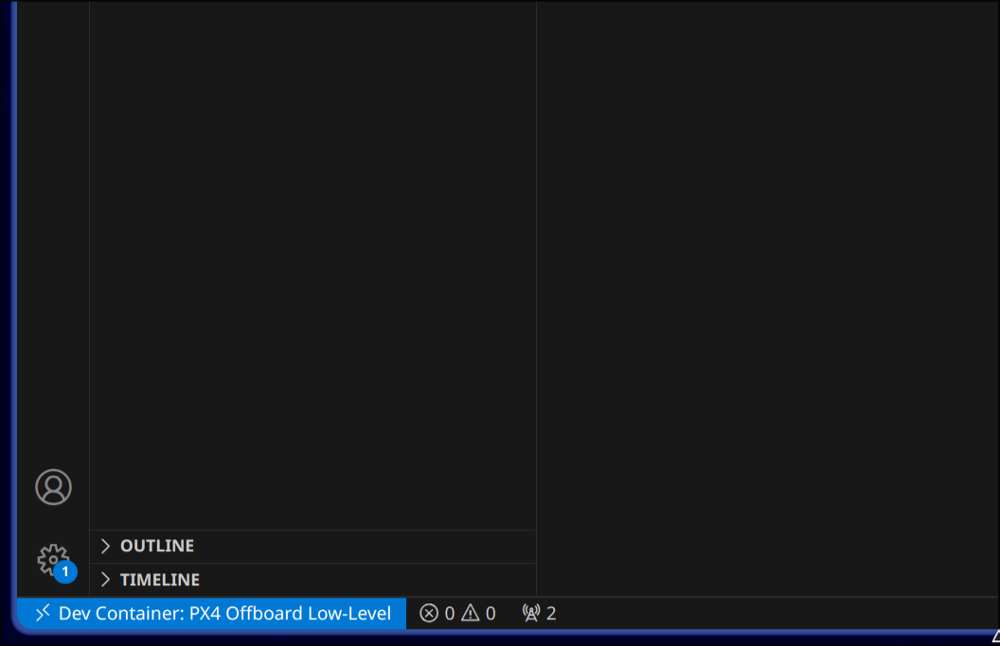
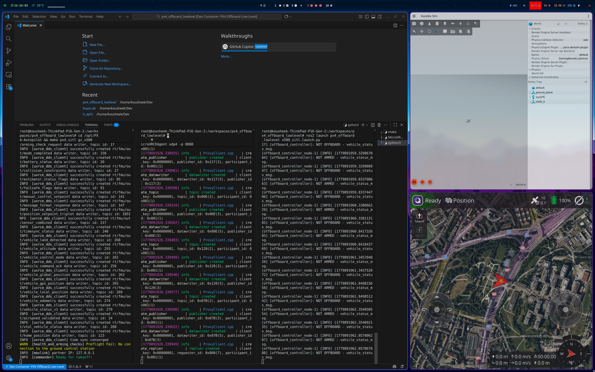

# Dev Container Setup Guide

This guide walks you through setting up the development environment using VS Code Dev Containers.

---

## Prerequisites

Install the following before you begin:

- [Docker Desktop](https://www.docker.com/products/docker-desktop/) (Windows/macOS) or [Docker Engine](https://docs.docker.com/engine/install/) (Linux)
- [Visual Studio Code](https://code.visualstudio.com/)
- [Dev Containers extension](https://marketplace.visualstudio.com/items?itemName=ms-vscode-remote.remote-containers) for VS Code



---

## Step 1 Clone the repository

```bash
git clone https://github.com/SaxionMechatronics/px4_offboard_lowlevel.git
cd px4_offboard_lowlevel
git checkout drone-minor
```

---

## Step 2 Open the folder in VS Code

```bash
code px4_offboard_lowlevel
```

Or open VS Code and use **File → Open Folder** to select the cloned directory.

---

## Step 3 Reopen in Container

VS Code will detect the `.devcontainer` configuration and show a notification in the bottom-right corner.

Click **Reopen in Container**.



If the notification doesn't appear, open the Command Palette (`Ctrl+Shift+P`) and run:

```
Dev Containers: Reopen in Container
```



VS Code will pull the pre-built Docker image (~5 GB) and run the workspace build automatically. This takes a few minutes on first use.

Once complete, the bottom-left corner of VS Code will show **Dev Container: PX4 Offboard Low-Level**.




---

## Step 4 (Linux only) Allow GUI access

Before launching the simulation, run this once in a **host terminal** (not inside VS Code):

```bash
xhost +local:docker
```

> **Windows (WSL2) and macOS users can skip this step** — display forwarding is handled automatically.

---

## Step 5 Launch the simulation

Open a terminal inside VS Code and run the following commands, each in a **separate terminal tab**:

**Tab 1 Start PX4 SITL + Gazebo:**
```bash
cd /opt/PX4-Autopilot && make px4_sitl gz_x500
```

**Tab 2 Start the Micro XRCE-DDS Agent:**
```bash
MicroXRCEAgent udp4 -p 8888
```

**Tab 3 Launch the controller nodes:**
```bash
ros2 launch px4_offboard_lowlevel x500_sitl.launch.py
```


---
