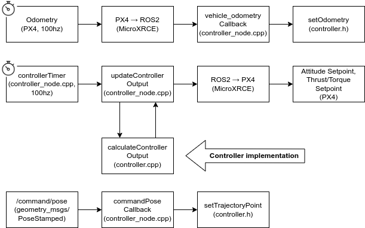

# Explanation
The ``px4_offboard_lowlevel`` node of this package consists of [``controller_node.cpp``](/src/controller_node.cpp) for the ControllerNode class which handles communication to ROS2 and PX4, and [``controller.cpp``](/src/controller.cpp) which contains the controller itself, both have corresponding header files in [``include/px4_offboard_lowlevel``](/include/px4_offboard_lowlevel). For the implementation of your own controller you will probably only need to make changes to [``controller_node.cpp``](/src/controller_node.cpp).

# Overview


# ControllerNode
The ControllerNode class implements the interface between the controller, ROS2 and PX4. It provides the controller with odometry and setpoints, and it requests the controller to calculate desired outputs (attitude or thrust + torque) at a set interval.

# Controller
The Controller class implements the controller itself.
## Controller output
The desired output is requested by the ControlledNode using the calculateControllerOutput function. It takes a vector for thrust and torque and a quaternion for orientation, these should both be set to the desired values. This may be the only function you need to change to implement your own controller.
```CPP
calculateControllerOutput(Eigen::VectorXd *controller_torque_thrust, Eigen::Quaterniond *desired_quaternion)
```

## Other interfaces
### UAV Parameters
UAV Parameters are passed to the controller using the following functions:
```CPP
setUavMass(double uavMass)
setInertiaMatrix(const Eigen::Vector3d &inertiaMatrix)
setGravity(double gravity)
setKPositionGain(const Eigen::Vector3d &PositionGain)
setKVelocityGain(const Eigen::Vector3d &VelocityGain)
setKAttitudeGain(const Eigen::Vector3d &AttitudeGain)
setKAngularRateGain(Eigen::Vector3d AngularRateGain)
```

### Odometry
Odometry (position, orientation, velocity and angular velocity) is provided to the controller through the setOdometry funciton, this is called by the ControllerNode class every time odometry is received from PX4. 

```CPP
const Eigen::Vector3d &position_W, const Eigen::Quaterniond &orientation_W)
```

### Setpoints
Position and orientation setpoints are provided to the controller through the setTrajectoryPoint function.

```CPP
setTrajectoryPoint(const Eigen::Vector3d &position_W, const Eigen::Quaterniond &orientation_W)
```

## Working with another vehicles

Check the parameters that needs to be defined for each vehicle in `./config/uav_parameters/iris_param.yaml`. By creating another parameters yaml file and another launch file based on `./launch/iris_sitl.launch.py`, you should be able to fly another vehicle with the package.